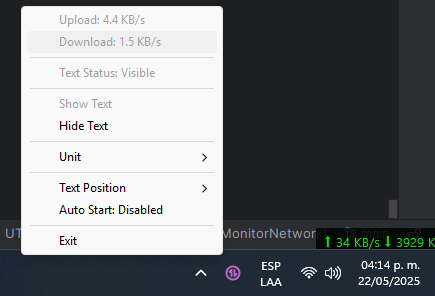

# NetMonitor by Python

### English
NetMonitor is a lightweight open source tool to monitor your internet upload and download speeds in real-time. It runs silently in the system tray and optionally displays a floating text window on the screen with live speed updates.
#### Features:
- Displays current upload and download speeds.
- Shows a floating overlay with current speeds.
- Tray icon with context menu: 
- Show/Hide speed overlay. 
- Change text position (7 options). 
- Enable/Disable drag mode. 
- Enable/Disable auto start on Windows. 
- Exit application.
- Configuration saved between sessions: Drag mode, Auto start and Text position.

### Spanish
NetMonitor es una herramienta ligera y de código abierto para monitorear la velocidad de subida y bajada de internet en tiempo real. Funciona silenciosamente en la bandeja del sistema y opcionalmente muestra un texto flotante en pantalla con actualizaciones en vivo de la velocidad.
#### Características:
- Muestra las velocidades actuales de carga y descarga.
- Muestra una superposición flotante con las velocidades actuales.
- Icono en la bandeja con menú contextual:
- Mostrar/Ocultar superposición de velocidad.
- Cambiar la posición del texto (7 opciones).
- Activar/Desactivar el modo de arrastre.
- Activar/Desactivar el inicio automático en Windows.
- Salir de la aplicación.
- Configuración guardada entre sesiones: Modo de arrastre, Inicio automático y Posición del texto.


## Screenshots
#### Icon Monitor

#### Icon Monitor Panel

#### Text Monitor

### Installation / Instalación
#### Requirements / Requisitos
- Python 3.7 or higher / Python 3.7 o superior
- pip (Python package manager)
- `psutil`
- `pystray`
- `Pillow`
- `tkinter`
- Windows OS (tested, other OS may require adjustments)


## 🧪 Development setup
1. Clone the repository:
``` git clone https://github.com/your_user/MonitorInternet.git ```
2. Enter the project
``` cd netmonitor ``` 
3. Install the dependencies with:
``` pip install -r requirements.txt```
4. Run the program:
``` python main.py ```

## ⚙️ Build executable 
1. To create a standalone executable (Windows):
```pyinstaller --onefile --add-data "assets/monitor_internet.ico;assets" --windowed --icon=assets/monitor_internet.ico main.py ```

## 🛠 Installer with Inno Setup
1. Build executable using PyInstaller (see above).
2. Use [Inno Setup](https://jrsoftware.org/isinfo.php) with this script (installer.iss):


## 📥 Descargas / Downloads

- 🔽 [**Descargar Ejecutable** (MonitorInternet.exe)](./dist/main.exe)
- 💿 [**Descargar Instalador** (Setup.exe)](./Output/NetMonitorSetup.exe)


## 🖥️ Usage
1. Run the installer or the .exe file.
2. You'll see the icon in the system tray.
3. Use the menu to show, hide, position, or move the hover text.